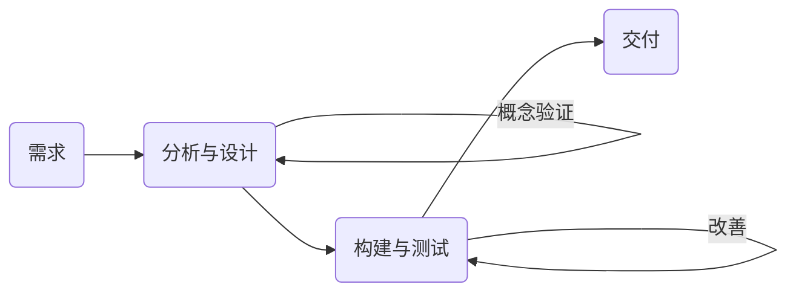

# 1. 引论

这里用了一个叫做预测法的东西作为对比。作者提到，本书适用于：

- 对于预测法与敏捷方法难以取舍的项目团队。
- 试图解决快速创新和复杂性问题的项目团队。
- 致力于团队改进的项目团队。

本书的目的是：

- 帮助项目取得成功。
- 帮助项目团队顺利交付商业价值。
- 满足客户的期望和需求。

看第一章所述内容似乎是解决新技术应用到现有的项目上，但寻求不降低项目开发效率的项目管理思路，称之为敏捷思维模式。

# 2. 敏捷概述

## 2.1 可确定的工作与高度不确定的工作

项目工作包括两种不同类型：

- 可确定的工作 - 执行的不确定性和风险通常较低，归宿是自动化。
- 高度不确定的工作 - 探索性工作，项目变化速度快，复杂性和风险高。

这里提到了**预测法**，其实就是传统开发过程，大概类似可行性分析、需求分析、总体设计、详细设计、编码、测试、部署上线的软件开发流程。这种流程应对变更的能力稍微有点弱（其实就是每一个阶段的质量都必须充分的保证，给人犯错的空间比较小），所以这个时候需要一种在短时间内探讨可行性，根据评估和反馈快速调整的开发过程（给试错的空间，这里跟高度不确定性相呼应），也就是敏捷方法。

## 2.2 《敏捷宣言》及思维模式

- 四大价值观
  - 重视个体以及互动而不是过程和工具。
  
    > 这个应该是为了发掘更多可改善的地方。
  - 可用的软件而不是完整的文档。
  
    > 这个大概是讲软件比较完善的时候再沉淀一下弄文档？不然对项目专家的依赖度也太高了。
  - 客户合作而不是合同谈判。
  
    > 这个应该是针对深入业务这一点所说的吧。但是感觉这两个并没有对立关系。
  - 应对变更而不是遵循计划。
  
    > 个人觉得这点恐怕对团队的能力要求有点高。

> 上面所说的是敏捷开发的一个价值观，总体来讲我觉得对整个团队里每个人能力的要求都要比传统的高一点，这个不太好做其实。

- 十二大原则
  - 最高目标，通过尽早持续交付有价值的软件来满足客户的需求。
  
    > 比起传统方法多了个快。
  - 欢迎对需求提出变更，善于利用变更，以帮助客户获得竞争优势。
  
    > 其实需求变更这个东西怎么说呢，软件开发者不太想要。至少能不停变更需求的软件与定好需求的软件不是一个价格，基于需求要变更这个前提，敏捷开发会比传统方法舒服。
  - 要经常交付可用的软件。
  
    > 这里应该是指局部交付，以避免所有东西都做出来结果发现不尽人意这种情况，通过这种方式尽快找出错误。
  - 项目实施过程中，业务人员与开发人员必须始终通力合作。
  
    > 这一点我个人是非常赞同的。很多时候，开发人员从技术上提升的代价比更深入理解业务大很多。
  - 善于激励项目人员，给予他们所需的环境和支持，并相信他们能够完成任务。 
  
    > 我觉得看人。
  - 无论是对开发团队还是团队内部，信息传达最有效的方法都是面对面交谈。
  
    > 确实。
  - 可用的软件是衡量进度的首要衡量标准。 
  
    > 类似于 Talk is cheap, show me your code.
  - 敏捷过程提倡可持续的开发。项目发起人、开发人员和用户应该都能够始终保证持续步调稳定性。 
  
    > 对开发人员的状态是个考验。
  - 对技术的精益求精以及对设计的不断完善将提高敏捷性。 
  
    > 其实这点是不是敏捷开发都一样的。
  - 简洁，即尽最大可能减少不必要的工作。
  
    > 这点对管理者是个考验。
  - 最佳的架构、需求和设计将出自组织团队。
  
    > 对组织团队有点依赖，不过要敏捷的话确实只有这样。
  - 团队定期反省怎样做才能更有效，并相应地调整团队地行为。
  
    > 这点讲究开发过程的变化。

## 2.3 精益与看板方法

重点在于：

- 交付价值

  > 我觉得是指客户满意度这方面来讲。

- 尊重人

  > 对客户来讲确实尊重，对开发者来讲其实有点压榨的意思，当然也可以说是信任开发者，这个恐怕得看人。

- 减少浪费

  > 这点对项目经理（专家）要求会高一点。

- 透明化

  > 这个确实是优点，可以看到每个人在干嘛。

- 适应变更

  > 这个有点像是附加价值。

- 持续改善

  > 比起改善更强调持续。这种对项目发起人的要求会高一点，可能会出现一种情况，就是项目发起人指负责规划并不参与做项目，由开发技术员做，感觉提供价值方面不太好说。

## 2.4 不确定性、风险和生命周期选择

这里不确定性指需求的不确定性与技术的不确定性两方面，风险指返工的风险。

这里提倡用较小的工作增量验证自身的工作，相当于是每做一个模块的东西，就去汇报验证看是否满足需求，即使返工也只是很小的返工这种方式。

- 非常短的反馈循环。
- 频繁调整过程。
- 重新进行优先级排序。
- 定期更新计划。
- 频繁交付。

但是这里也明确说了并不是什么都适合敏捷开发，如果一项任务没有中间成果，或者没有原型的时候，比较适合主用预测法去开发，用敏捷方法去管理新的迭代需求和增量交付成果。

当技术和需求的不确定性都很高的时候，为了使项目可靠，需要先遏制其中一个不确定性的变量。

> 从这一节开始，我觉得他讲得有点道理。

# 3. 生命周期选择

这里详细说明了 4 种生命周期的定义：

- 预测型生命周期 - 提前进行大量的计划工作，然后一次性执行；执行时一个连续的过程。
- 迭代型生命周期 - 这种方法允许对未完成的工作进行反馈，从而改进和修改该工作。
- 增量型生命周期 - 这种方法向客户提供各个已完成的，可能立即使用的可交付成果。
- 敏捷型生命周期 - 这种方法既有迭代，也有增量，便于完善工作，频繁交付。

## 3.1 项目生命周期的特征

| 方法   | 需求 | 活动               | 交付             | 目标                                   |
| ------ | ---- | ------------------ | ---------------- | -------------------------------------- |
| 预测型 | 固定 | 整个项目仅执行一次 | 一次交付         | 管理成本                               |
| 迭代型 | 动态 | 反复执行直至修正   | 一次交付         | 解决方案的正确性                       |
| 增量型 | 动态 | 对给定增量执行一次 | 频繁更小规模交付 | 速度                                   |
| 敏捷型 | 动态 | 反复执行直至修正   | 频繁小规模交付   | 通过频繁小规模交付和反馈实现的客户价值 |

选择哪一个生命周期取决于需求的变更程度与交付频率。

|                | 需求变更低 | 需求变更高 |
| -------------- | ---------- | ---------- |
| **交付频率高** | 增量型     | 敏捷型     |
| **交付频率低** | 预测型     | 迭代型     |

### 3.1.1 预测型生命周期的特征

强调部门划分、有效、顺序的工作。有点谋定而后动的意思，好处自然就是计划非常清晰明了，文档也易构建。坏处就是可能在开发之前就得确定好明确的需求，除此之外还需要对技术有充分的了解，应对需求不确定性和技术不确定性的能力太弱。

### 3.1.2 迭代型生命周期的特征

有点类似与一个学习的开发过程。通过连续的原型或概念验证来改进产品或成果。在同一个时间盒内可能涉及到长达数周时间的迭代。生命周期可能会很长，因为它是为了学习而优化，而不是为交付速度而优化。

### 3.1.3 增量型生命周期的特征

一点一点的交付，突出交付速度快，减少潜在返工。

### 3.1.4 敏捷生命周期的特征

类似增量型和迭代型的结合体。

### 3.1.5 敏捷适用性筛选器

### 3.1.6 混合生命周期的特征

依据不同的目标在项目不同的模块选择不同的开发方法。

### 3.1.7 结合了敏捷和预测的方法

### 3.1.8 以预测法为主、敏捷方法为辅的方法

### 3.1.9 以敏捷方法为主、预测法为辅的方法

### 3.1.10 符合目的的混合生命周期

要根据目的去选择开发方法。

### 3.1.11 混合型生命周期作为过渡策略

在预测法的项目上去使用敏捷方法作为过渡而不是一开始就在大项目上使用敏捷方法。

## 3.2 混合敏捷方法

敏捷方法有很多，根据需要进行组合。

## 3.3 影响裁剪的项目因素

| 项目因素             | 裁剪方案                                                     |
| -------------------- | ------------------------------------------------------------ |
| 对不稳定需求的适应   | 使用节奏（定期时间盒）帮助团队进行演示、回顾与理解新任务。   |
| 改进速度不够快       | 更频繁地回归并选择改进措施。                                 |
| 工作流容易被打断     | 利用看板让工作可见，分配任务优先级。                         |
| 产品增量质量不佳     | 以测试为重点。                                               |
| 多团队协同           | 精心制定一种符合项目背景的方法。                             |
| 团队成员缺乏敏捷经验 | 培养敏捷思维模式和敏捷原则的基本原理。使用特定敏捷方法前开研讨会。 |

# 4. 实施敏捷：创建敏捷环境

## 4.1 从敏捷思维模式开始

从几个问题开始：

- 项目团队如何以敏捷方式行动？
- 为了使下一交付周期受益，团队需要快速交付哪些成果并获得早期反馈？
- 团队如何以一种透明的方式行动？
- 为了专注于高优先级的目标，可以避免哪些工作？
- 仆人式领导对团队达成目标有何益处？

## 4.2 仆人式领导为团队赋权

仆人式领导使通过对团队服务来领导团队的实践，它注重理解和关注团队成员的需要和发展，旨在使团队尽可能达到最高成绩。

### 4.2.1 仆人式领导的职责

- 促进合作。
- 审视阻碍敏捷的过程，努力使其合理化。
- 鼓励团队成员，让人尽其才。
- 培养团队发展。

### 4.2.2 项目经理在敏捷环境中的角色

项目经理作为技术人员的服务者而不是管理者。

### 4.2.3 项目经理应用仆人式领导

要把责任分配给有能力的人。

## 4.3 团队构成

### 4.3.1 敏捷团队

| 属性                             | 目标                                                         |
| -------------------------------- | ------------------------------------------------------------ |
| 专门人团                         | 专心，提高工作效率；少于十人的小型团队。                     |
| 跨职能团队成员                   | 频繁开发交付；作为独立团队交付；整合工作；向团队内部外部提供反馈。 |
| 集中办公或有能力应对办公地点不同 | 改善沟通；挺高团队动力；知识共享；降低学习成本；合作。       |
| 通才和专家组成的混合团队         | 专家提供专门技能，通才提供从事不同工作的灵活性；团队具有专业能力，体现在都称为通才型专家。 |
| 稳定的工作环境                   | 彼此依赖；对工作方法相互认同；简化团队成本；知识资本的保证和发展。 |

> 这，感觉对技术人员的要求也太高了。感觉不太可行。

### 4.3.2 敏捷的角色

- 跨职能团队成员

- 产品负责人

  > 我感觉这个才是真正的大佬。

- 团队促进者

  > 听起来有点玄乎。Scrum Master 居然是这个，我说实话不能接受。

### 4.3.3 通才型专家

知识广度够，也有专攻的 T 字型人才。

### 4.3.4 团队结构

以产品为主，将人员组织到跨职能的团队中。

> 做东西来讲这点挺好，问题就是这个知识和技术积累有点困难。

### 4.3.5 专职小组成员

这里阐述在这个团队里专职工作的小组成员比较重要。分散尽力去做多个项目会造成切换时的效率浪费。

### 4.3.6 团队工作场所

独立的私人办公区域与定期开会合作交流。

### 4.3.7 克服组织孤岛

平等的话语权，意见都能被听到并得到考虑。

> 前提是有话语权的人有足够水平的见解和技术吧。

# 5. 实施敏捷：在敏捷环境中交付

## 5.1 项目章程和团队章程

章程：

- 项目重要的原因
- 团队前景方向
- 项目目标

敏捷项目章程：

- 项目愿景 - 我们为什么要做这个项目？
- 项目远景或项目目标的一部分 - 谁会从中受益？如何受益？
- 项目的发布标准 - 达到哪些条件才意味着项目完成？
- 预期的工作流 - 我们将怎样合作？

团队章程：

- 团队价值观。
- 工作协议，“就绪”如何定义，这是团队可以接受工作的前提；“完成”如何定义，达成一致；考虑时间盒，使用工作过程限制。
- 基本规则，有关一个人在会议发言上的规定。
- 团队规范，团队如何对待会议时间。

## 5.2 常见敏捷实践

### 5.2.1 回顾

团队定期反省如何能够做到更加有效，并相应地调整团队的行为。

### 5.2.2 待办事项列表编制

所有工作的有序列表，故事。

### 5.2.3 待办事项列表的细化

任务，可能是即时制定的，也可能是迭代会上制定的，也可以是多次会议讨论（比较陌生的项目）。

### 5.2.4 每日站会

过一下看板和任务盒。回答以下问题：

- 基于迭代的敏捷

  - 上次站会以来我都完成了什么？

  - 从现在到下一次站会，我计划完成什么？

  - 我的障碍是什么？

- 基于流程的敏捷

  - 我们还需要做些什么来推进这一工作？
  - 有人在做看板上没有的事情吗？
  - 作为一个团队，我们需要完成什么？
  - 工作流程是否存在瓶颈或障碍？

### 5.2.5 展示/评审

故事完成后，展示时，产品负责人接受或拒绝故事。

### 5.2.6 规划基于迭代的敏捷

反复计划与学习。

> 这块我感觉是为了敏捷而敏捷。

### 5.2.7 帮助团队交付价值的执行实践

- 持续集成
- 在不同层面测试
- 验收测试驱动开发
- 测试驱动开发
- 刺探（时间盒研究或实验）

### 5.2.8 迭代和增量如何帮助交付工作产品

迭代帮助团队为交付和多种反馈创建一个节奏。

增量帮助团队频繁交付。

## 5.3 解决敏捷项目的挑战

| 痛点                                 | 解决                                         |
| ------------------------------------ | -------------------------------------------- |
| 目标或任务不明确                     | 愿景、使命。                                 |
| 工作协议不明确                       | 价值观、原则和工作协议。                     |
| 团队环境不明确                       | 边界、承诺资产和前瞻性分析。                 |
| 需求不明确                           | 帮助发起人和相关方制定产品愿景。             |
| 用户体验不佳                         | 设计实践早期让用户参与。                     |
| 估算不准确                           | 分解故事。进一步细估。                       |
| 工作分配或进展不明确                 | 自我管理工作。看板，每日站会。               |
| 团队面临障碍                         | 仆人式领导消除，消除不了就上报。             |
| 产品待办事项不完善导致工作延误、超时 | 产品负责人和团队一起研讨故事。“就绪”的定义。 |
| 缺陷                                 | 完成工作的定义。                             |
| 工作未完成                           | 为完成工作定义。                             |
| 技术债务                             | 重构，测试。                                 |
| 产品复杂性过高                       | 提倡简单，思考简单。                         |
| 合作进展缓慢                         | 仆人式领导负责协调。                         |
| 前期工作过多导致返工                 | 不要做过多的工作，通过刺探来学习。           |
| 错误的开始                           | 产品负责人的重要性。                         |
| 待办事项无序                         | 创建不同优先级。                             |
| 不均匀的工作流程                     | 计划对应团队的能力。                         |
| 相关方要求无法满足                   | 仆人式领导与产品负责人一起工作。             |
| 意想不到或不可预见的延误             | 团队更频繁地检查工作流。                     |
| 孤立的团队，而不是跨职能团队         | 讲明是以产品为主的团队而不是以职能。         |

## 5.4 敏捷项目的衡量指标

定义完成和拒绝。

### 5.4.1 敏捷团队的衡量结果

倾向使用基于经验和价值的衡量指标，而不是预测型衡量指标。

# 6. 关于项目敏捷性的组织考虑因素

## 6.1 组织变革管理

### 6.1.1 变革管理驱动因素

- 与加速交付相关的变革。
- 与敏捷方法相关的变革。

### 6.1.2 变革就绪情况

变革友好型特征：

- 管理层的变革意愿。
- 组织在员工认知、审核和评估方式上做出改变的意愿。
- 集中或分散项目、项目于集和项目组合管理职能。
- 专注于短期预算和指标而不是长期目标。
- 人才管理成熟度和能力。

## 6.2 组织文化

### 6.2.1 创建安全环境

安全、诚实、透明。

### 6.2.2 评估文化

- 探索 or 执行
- 速度 or 稳定性
- 数量 or 质量
- 灵活性 or 可预测性

## 6.3 采购和合同

- 多层结构。
- 强调价值交付。
- 总价增量。
- 固定时间和材料。
- 累进的时间和材料。
- 提前取消方案。
- 动态范围方案。
- 团队扩充。
- 支持全方位供应商。

